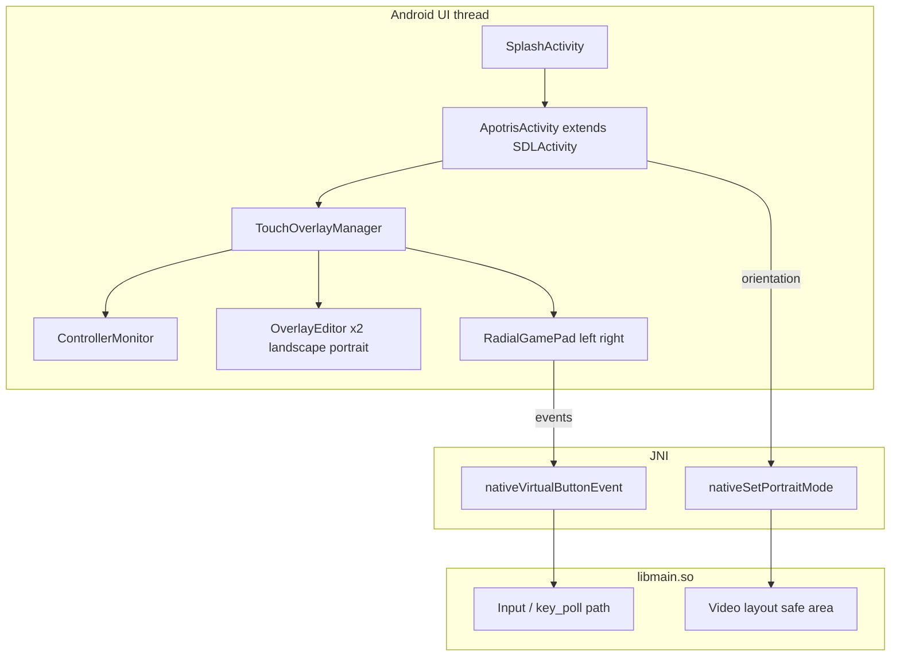

# Full reimplementation plan: decompiled APK → repo build

## 1. Goal

Restore **feature parity** with the shipped Android APK:

- Touch **RadialGamePad** overlay (left D-pad + L/SELECT, right A/B + R/START)
- **Automatic hide** when a gamepad is connected; **show** again on screen touch or when pads disconnect
- **Portrait** stacked layout (game surface + control band) vs **landscape** fullscreen game + floating overlay
- **Overlay editor**: long-press to move/scale pads; **persist** layout per orientation (`SharedPreferences`)
- **JNI bridge**: `nativeVirtualButtonEvent`, `nativeSetPortraitMode` wired into **libmain** input/render path
- **Splash** flow (already partially restored in `android-port`)

## 2. Current repo state (unfinished)

| Area | Today | Shipped |
|------|--------|---------|
| Native | `libmain.so` (SDL + game), `getLibraries() = ["main"]` | Same model |
| Java/Kotlin app | `ApotrisActivity`, `SplashActivity`, splash assets, minimal manifest | + full `SDLActivity`/`SDLSurface` patches, Kotlin managers |
| Touch UI | None | `TouchOverlayManager` + `RadialGamePad` |
| Controller detection | SDL defaults only | `ControllerMonitor` + explicit hide/show |
| Orientation UI | Manifest `fullSensor`; SDL surface only | `applyOrientationLayout` + `nativeSetPortraitMode` |
| Overlay persistence | None | `overlay_layout` prefs |
| JNI extras | None in tree | `nativeVirtualButtonEvent`, `nativeSetPortraitMode` |

## 3. Architecture (target)

## 4. Workstreams

### 4.1 Native (C/C++)

1. **Register JNI** methods for `SDLActivity` (or a thin subclass package `com.apotris.android` if you move JNI to match `ApotrisActivity`—prefer keeping `org.libsdl.app` class name for SDL compatibility).
2. **`nativeVirtualButtonEvent(id, pressed)`**  
   - Inject logical button down/up consistent with SDL gamepad button indices (see [INVENTORY-decompiled.md](./INVENTORY-decompiled.md)).  
   - Must interact correctly with `saving.cpp` key rebinding (packed `GameKeys` use controller masks in places)—validate that virtual ids match what the game expects after remaps.
3. **`nativeSetPortraitMode(boolean)`**  
   - Adjust **viewport**, **safe area**, or **UI scaling** if the game has separate portrait behavior (inspect `liba_window` / Android-specific code paths).

**Deliverable:** symbols visible in `libmain.so`; no crash when JNI called from stub Java.

### 4.2 SDL Java layer (fork or patch)

**Option A (recommended):** Subclass `SDLActivity` as `ApotrisActivity` and **copy** shipped layout/orientation/overlay hooks into the subclass, overriding `onCreate` / `onConfigurationChanged` / `onStart` / `onStop`, and expose static overlay manager for `SDLSurface`.

**Option B:** Patch files under `main/apotris/subprojects/SDL2-*/android-project/...` and re-apply after SDL updates (fragile).

**SDLSurface:** mirror shipped touch hook (`onScreenTouch` on first pointer down).

**Deliverable:** Gradle project uses patched surface + activity; `build.ps1` still copies SDL base then overlays `android-port` (extend overlay to include **kotlin** + **java** trees).

### 4.3 Kotlin + Gradle

- Enable **Kotlin**, **Compose** (if any shipped UI uses it—Radial stack may be mostly Views + optional Compose helpers like `GlassSurfaceKt`).
- Add dependencies: **Coroutines**, **AndroidX Core** (already partially there for splash), **AppCompat** if required by RadialGamePad, material/compose BOM as needed.
- **Vendoring:** bring `com.example.apotris` sources into `com.apotris.android` (or keep package and align `applicationId`—prefer one package for store identity).

**Deliverable:** `assembleRelease` with overlay code compiling.

### 4.4 RadialGamePad / Swordfish libraries

- Obtain **source** (Lemuroid fork, Apotris fork, or internal copy) or **AARs**.
- Fix package imports and R class references.
- Confirm **ProGuard** rules if minify is ever enabled.

**Deliverable:** touch pads render and emit `Event.Button` / `Event.Direction`.

### 4.5 Controller vs touch policy

- Port `ControllerMonitor` (Kotlin) as-is conceptually.
- Wire `TouchOverlayManager.start`/`stop` to lifecycle.
- Ensure **race-free** visibility: connected count > 0 → hide overlay; screen touch → force show (shipped behavior for “I want touch again”).

### 4.6 Orientation and layout

- Port `applyOrientationLayout`:
  - **Portrait:** `LinearLayout` vertical, weights 1:1, top = `FrameLayout` + `mSurface`, bottom = `controlsContainer` for overlay attachment; call `nativeSetPortraitMode(true)`.
  - **Landscape:** `mLayout` + `mSurface` fullscreen; `attach(mLayout)`; `nativeSetPortraitMode(false)`.
- Handle **multi-window** and **configuration** changes: detach overlay, rebuild hierarchy (shipped pattern).

### 4.7 Saving: three distinct concepts

| Concept | Storage | Responsibility |
|---------|---------|----------------|
| Game settings / key bindings | Apotris save file (`saving.cpp`) | C++; already handles controller-centric packing |
| Touch **pad positions/scales** | `SharedPreferences` `overlay_layout` | `OverlayEditor`; Android only |
| Optional “prefer touch even with pad” | Not in shipped APK | Future enhancement |

Do **not** mix overlay geometry into the C++ savefile unless you explicitly want cross-platform sync (usually you do not).

### 4.8 Splash, USB, signing

- Splash: done in `android-port` (verify theme + assets parity).
- USB intent filter: present in manifest; keep in sync with SDL HID paths.
- Signing: unchanged (`build.ps1` + uber signer).

## 5. Risks and mitigations

| Risk | Mitigation |
|------|------------|
| JNI names/descriptors mismatch | Use `javac -h` or SDL’s `RegisterNatives`; verify with `adb logcat` on `UnsatisfiedLinkError` |
| Input double-firing (touch + pad) | Match shipped hide/show rules; consider eating events in overlay views |
| Portrait aspect / HUD clipping | Implement `nativeSetPortraitMode` with real game testing |
| License for Swordfish/Lemuroid code | Confirm licenses before redistributing; document in `NOTICE` |
| `build.ps1` overwrites `build.gradle` | Move app Gradle to a **template file** in repo or generate Kotlin plugin lines from script |

## 6. Verification

1. **No gamepad:** overlay visible; all buttons and D-pad drive gameplay.
2. **USB/BT gamepad connect:** overlay hides; physical input works.
3. **Touch after pad:** overlay shows again (per shipped `onScreenTouch`).
4. **Rotate device:** layout swaps portrait/landscape bands; prefs load correct `OverlayEditor` (`landscape` vs `portrait`).
5. **Long-press edit:** move/scale pads; kill app; relaunch; geometry restored.
6. **Game saves:** unrelated regressions; key rebinding in-game still consistent with virtual buttons.

## 7. Suggested phase order

See [TASKS.md](./TASKS.md) for numbered items. High level:

1. JNI in native + minimal Java stubs (prove link).  
2. SDL activity/surface integration (orientation + hooks only, no Radial yet).  
3. Vend RadialGamePad + TouchOverlayManager port.  
4. ControllerMonitor + visibility.  
5. OverlayEditor + SharedPreferences.  
6. Polish (haptics, accessibility, edge cases).
